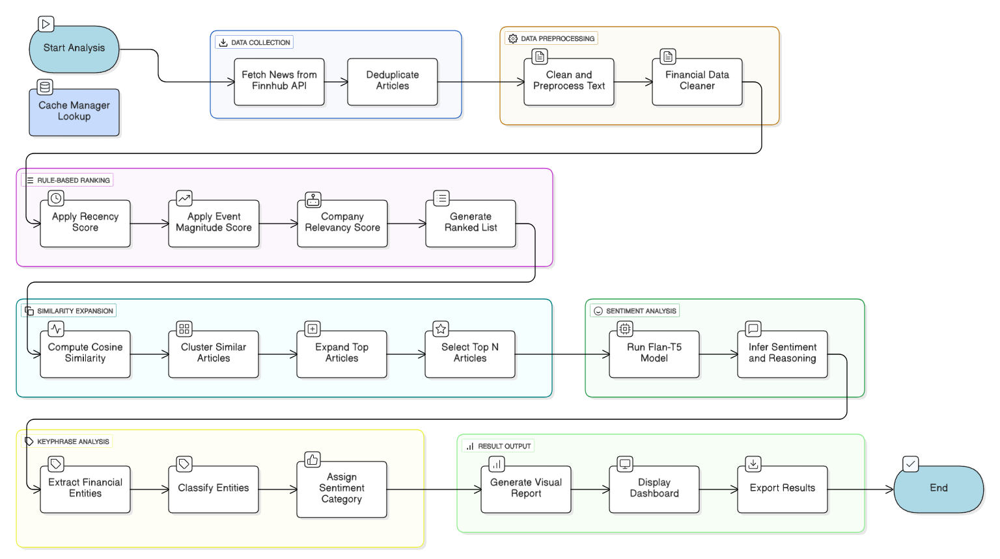

# Stock Market Sentiment Analyzer

> AI-powered financial news analysis platform using deep learning for sentiment prediction, keyphrase extraction, and intelligent article ranking.

[](LICENSE)
[](https://www.python.org/downloads/)

---

## 📋 Table of Contents

- [Overview](#overview)
- [Features](#features)
- [Architecture](#architecture)
- [Quick Start](#quick-start)
- [Documentation](#documentation)
- [Usage Examples](#usage-examples)
- [API Reference](#api-reference)
- [Contributing](#contributing)
- [License](#license)

---

## 🎯 Overview

The Stock Market Sentiment Analyzer is an end-to-end system that fetches, processes, and analyzes financial news articles to provide actionable insights for stock market analysis. It combines rule-based ranking, deep learning sentiment prediction (Flan-T5), and advanced keyphrase extraction to deliver comprehensive article analysis.

### Key Capabilities

- **Real-time News Fetching**: Retrieves latest financial news from Finnhub API with intelligent caching
- **Deep Learning Sentiment Analysis**: Uses fine-tuned Flan-T5 model for accurate sentiment prediction
- **Intelligent Ranking**: Combines recency, event magnitude, and similarity scoring
- **Keyphrase Extraction**: Identifies and classifies key financial terms and entities
- **Interactive Frontend**: Streamlit-based UI for easy exploration and analysis
- **RESTful API**: FastAPI backend for seamless integration

---

## ✨ Features

### 🔍 Data Processing
- **Financial Text Cleaning**: Custom preprocessing pipeline preserving financial terminology
- **Deduplication**: Smart duplicate detection and removal
- **Caching System**: Sub-millisecond cache hits with connection pooling
- **Rate Limiting**: Intelligent pagination to respect API limits

### 🤖 AI/ML Models
- **Flan-T5 Sentiment Predictor**: Fine-tuned transformer model for financial sentiment
- **Similarity Expansion**: Cosine similarity-based article grouping
- **Keyphrase Analyzer**: NLP-based extraction with sentiment classification
- **Rule-Based Ranker**: Multi-factor scoring (recency + event magnitude)

### 🎨 User Interface
- **Streamlit Frontend**: Interactive web interface for article exploration
- **Real-time Analysis**: Live updates and processing
- **Company Search**: Support for major tech companies (Apple, Google, Microsoft, Tesla, etc.)
- **Detailed Insights**: Sentiment scores, keyphrases, and ranking explanations

### 🔌 API Integration
- **FastAPI Backend**: High-performance REST API
- **Finnhub Integration**: Real-time financial news data
- **DeepSeek API**: Optional synthetic data generation
- **CORS Support**: Cross-origin requests enabled

---

## 🏗️ Architecture

### Architecture Diagram



### Tech Stack

**Backend**
- FastAPI (REST API)
- PyTorch (Deep Learning)
- Transformers (Hugging Face)
- Sentence-Transformers (Embeddings)
- NLTK & spaCy (NLP)

**Frontend**
- Streamlit (Web UI)
- Typescript (Responsive Web UI)
- Pandas (Data Handling)

**APIs & Services**
- Finnhub API (Financial News)
- DeepSeek API (Synthetic Data)
- Groq API (Similariy summary)

---

## 🚀 Quick Start

### Prerequisites

- Python 3.7+
- Git LFS (for model weights)
- API Keys:
  - Finnhub API key
  - DeepSeek API key (optional, for synthetic data generation)
  - Groq API key

### Installation

1. **Clone the repository**
   ```powershell
   git clone https://github.com/Adigo10/stock_market_sentiment_analyzer.git
   cd stock_market_sentiment_analyzer
   ```

2. **Install dependencies**
   ```powershell
   pip install -r requirements.txt
   ```

3. **Download NLTK resources**
   ```powershell
   python setup_nltk.py
   ```

4. **Set up the Flan-T5 model**
   ```powershell
   cd model
   git lfs install
   git clone https://huggingface.co/tssrihari/Flan_T5_Base
   cd ..
   ```

5. **Configure environment variables**
   
   Create a `.env` file in the project root:
   ```
   FINNHUB_API_KEY=your_finnhub_api_key_here
   GROQ_API_KEY=your_groq_api_key_here

   ```


### Running the Application

1. **Start the backend server**
   ```powershell
   python server.py
   ```
   Server runs on `http://localhost:8000`

2. **Start the frontend (in a new terminal)**
   ```powershell
   streamlit run frontend.py
   ```
   UI opens automatically at `http://localhost:8501`

3. **Quick launch**

   1. **Quick launch (Windows - Streamlit)**
   ```powershell
   .\start.bat
   ```

   2. **Quick launch (MacOS/Linux - Streamlit)**
   ```bash
   ./start.sh
   ```

   3. **Quick launch (Windows - React)**
   ```powershell
   .\start_react.bat
   ```

   4. **Quick launch (MacOS/Linux - React)**
   ```bash
   ./start_react.sh
   ```

## 📚 Documentation

Comprehensive guides and documentation are available in the [`doc/`](doc/) folder:

### Setup & Configuration
- **[Setup Guide](doc/setup.md)** - Complete installation and configuration instructions
- **[Quick Start Integration](doc/QUICK_START_INTEGRATION.md)** - Fast integration guide for the ML pipeline

### Core Components
- **[Data Fetching & Caching](doc/DATA_FETCHING.md)** - Finnhub API integration, caching system, and performance optimization
- **[Model Integration](doc/MODEL_INTEGRATION.md)** - Flan-T5 sentiment predictor and pipeline integration
- **[Rule-Based Ranking](doc/README_RULE_BASED_RANKING.md)** - Article ranking algorithm (recency + event magnitude)
- **[Similarity Scoring](doc/README_SIMILARITY_SCORING.md)** - Cosine similarity expansion and filtering
- **[Keyphrase Analyzer](doc/KEYPHRASE_ANALYZER.md)** - NLP-based keyphrase extraction and classification

### Data Generation & Frontend
- **[Sentiment Data Generator](doc/README_SENTIMENT_GENERATOR.md)** - Generate synthetic training data with DeepSeek API
- **[Frontend Usage](doc/FRONTEND_README.md)** - Streamlit interface guide

---

## 💡 Usage Examples

### 1. Analyze News for a Company

```python
from model_pipeline import FinancialNewsAnalyzer

analyzer = FinancialNewsAnalyzer()
results = analyzer.analyze_company("Apple")

for article in results:
    print(f"Headline: {article['headline']}")
    print(f"Sentiment: {article['predicted_sentiment']}")
    print(f"Keyphrases: {article['keyphrase_analysis']}")
    print("---")
```

### 2. Process Financial Text

```python
from src.data_process import FinancialDataCleaner
import json

sample_data = {
    "news": [
        {
            "id": 1,
            "title": "Tesla Reports Strong Q3 Results",
            "content": "Tesla reported Q3 earnings of $2.3B, beating analyst estimates by 15%.",
            "source": "Reuters",
            "date": "2024-10-15"
        }
    ]
}

cleaner = FinancialDataCleaner()
cleaned = cleaner.process_json_file('input.json', 'output.json')
```

### 3. Generate Synthetic Sentiment Data

```powershell
# Fetch 20 recent news items with sentiment analysis
python .\src\generate_synthetic_data.py --n 20

# Focus on specific companies
python .\src\generate_synthetic_data.py --n 15 --companies NVIDIA Microsoft OpenAI
```

Output CSV format:
```csv
source_name,source,sentiment
Reuters,"NVIDIA announced record quarterly earnings...",<senti>Good<reason>Strong earnings beat
Bloomberg,"Tesla delays FSD rollout...",<senti>Bad<reason>Product launch delays
```

### 4. Run Sentiment Prediction

```python
from src.sentiment_predictor import SentimentPredictor

predictor = SentimentPredictor()
prediction = predictor.predict_single("Apple launches new iPhone with AI features")
print(prediction)
# Output: "<senti>Good<reason>New product launch signals innovation and potential revenue growth"
```

---

## 🔌 API Reference

### GET `/companies`
Returns list of supported company symbols.

**Response:**
```json
{
  "companies": ["AAPL", "GOOGL", "MSFT", "TSLA", ...]
}
```

### POST `/analyze`
Analyze financial news for a specific company.

**Request:**
```json
{
  "company_name": "Apple"
}
```

**Response:**
```json
{
  "company_name": "Apple",
  "status": "success",
  "result": [
    {
      "id": 123,
      "headline": "Apple unveils new AI features",
      "summary": "Detailed summary...",
      "predicted_sentiment": "<senti>Good<reason>Innovation drive",
      "keyphrase_analysis": {
        "positive": ["AI features", "innovation"],
        "neutral": ["product launch"],
        "negative": []
      },
      "rank_score": 0.89,
      "recency_score": 0.95,
      "magnitude_score": 0.85
    }
  ]
}
```

For complete API documentation, see [DATA_FETCHING.md](doc/DATA_FETCHING.md).

---

## 🛠️ Project Structure

```
stock_market_sentiment_analyzer/
├── frontend.py              # Streamlit UI
├── server.py                # FastAPI backend
├── model_pipeline.py        # End-to-end orchestration
├── setup_nltk.py            # NLTK resource downloader
├── requirements.txt         # Python dependencies
├── start.bat                # Windows launch script
│
├── src/                     # Core modules
│   ├── fetch_data.py        # News fetching from Finnhub
│   ├── data_process.py      # Text preprocessing
│   ├── cache_manager.py     # Caching system
│   ├── rule_based_ranker.py # Article ranking
│   ├── sentiment_predictor.py # Flan-T5 sentiment model
│   ├── keyphrase_analyzer.py  # Keyphrase extraction
│   └── generate_synthetic_data.py # Data generation
│
├── pipeline/                # Batch processing
│   └── pipeline.py          # Similarity expansion
│
├── model/                   # ML models
│   └── Flan_T5_Base/        # Fine-tuned sentiment model
│
├── data/                    # Sample datasets
│   ├── ai_news_detailed.csv
│   └── ai_stock_sentiment_5k.csv
│
└── doc/                     # Documentation
    ├── setup.md
    ├── DATA_FETCHING.md
    ├── MODEL_INTEGRATION.md
    └── ... (other guides)
```

---

## 🤝 Contributing

Contributions are welcome! Please feel free to submit a Pull Request. For major changes:

1. Fork the repository
2. Create your feature branch (`git checkout -b feature/AmazingFeature`)
3. Commit your changes (`git commit -m 'Add some AmazingFeature'`)
4. Push to the branch (`git push origin feature/AmazingFeature`)
5. Open a Pull Request

---

## 📄 License

This project is licensed under the MIT License - see the [LICENSE](LICENSE) file for details.

---

## 🙏 Acknowledgments

- **Flan-T5 Model**: [HuggingFace](https://huggingface.co/tssrihari/Flan_T5_Base)
- **Finnhub API**: Real-time financial news data
- **Hugging Face**: Transformers and model hosting
- **Streamlit**: Interactive web framework
- **Contributors**: [View all contributors](https://github.com/Adigo10/stock_market_sentiment_analyzer/graphs/contributors)

---

## 📞 Support

For questions, issues, or feature requests:
- Open an issue on GitHub
- Check the [documentation](doc/) folder
- Review existing issues and discussions

---

**Built with ❤️ at NTU, Singapore**
